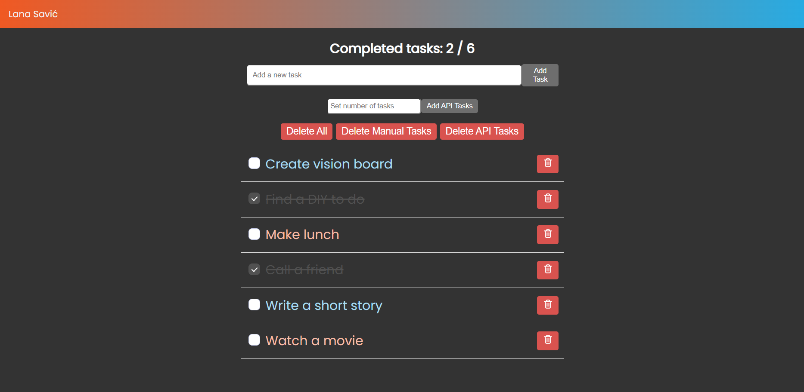

# To-Do App ✔

## About
To-Do application made with [Vite](https://vitejs.dev), [TypeScript](https://www.typescriptlang.org), [SCSS](https://sass-lang.com) and [DummyJSON API](https://dummyjson.com). Frontend job interview task for company Xiphias.

## Table of Contents
- [About](#about)
- [Table of Contents](#table-of-contents)
- [Preview](#preview)
- [Description](#description)
- [Project Structure](#project-structure)
- [Setup](#setup)
    - [Prerequisites](#prerequisites)
    - [Installation](#installation)

## Preview


## Description
To-Do App is an application built with Vite, TypeScript and SCSS. It allows users to manage tasks with features such as adding, completing or deleting tasks. Tasks are categorised into 'manual' and 'API' tasks, as well as distinctly styled. Using DummyJSON API, users can fetch a number of tasks which are then added into the list. Aside from the single task deletion, bulk deletion is available, as deleting all tasks, only manually added tasks, and only tasks sourced from the API. Input validation, error handling and success notifications are also implemented. BEM (Block Element Modifier) methodology is used in order to better organise the styles for the application.

## Project Structure
- src/
    - components/ - custom web components (Navbar.ts, TodoItem.ts, TodoList.ts)
    - resources/ - all assets used within the application
        - img/ - image assets, such as icons and logos (trashAlt.png, xiphiasTaskLogo.png)
    - styles/ - files that define the styles for the application (main.scss)

## Setup

### Prerequisites
- [NodeJS](https://nodejs.org/en/download/) (version 18+ or 20+)
- [Git](https://git-scm.com/downloads)

### Installation
1. Clone the repository
```bash
git clone https://github.com/lanasavic/to-do-app.git
```

2. Enter the project directory
```bash
cd to-do-app
```

3. Install dependencies
```bash
npm install
```

4. Run the local development server
```bash
npm run dev
```

[↑ Back to ToC ↑](#table-of-contents)
